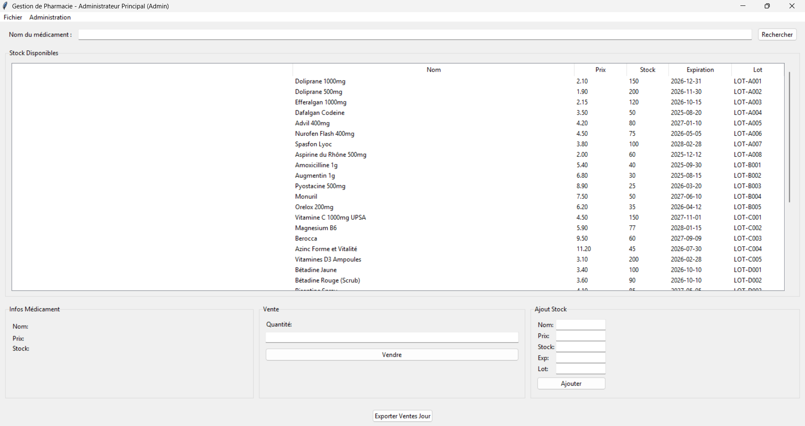

# GesPharma - Gestion de Pharmacie




GesPharma est une application de bureau complète pour la gestion de stock et de ventes en pharmacie. Elle inclut désormais une gestion avancée de la base de données, une authentification sécurisée et une interface multi-rôles.

##  Fonctionnalités Clés

*   **Authentification Sécurisée** : Connexion requise au lancement.
*   **Gestion des Rôles** :
    *   **Admin** : Accès complet, ajout de stock, gestion (future) des utilisateurs.
    *   **Caissier** : Accès limité à la vente et recherche.
*   **Base de Données Hybride** :
    *   **MySQL** (Recommandé) : Pour un usage en production.
    *   **SQLite** (Fallback) : Si MySQL n'est pas disponible, l'application bascule automatiquement sur une base locale pour fonctionner sans interruption.
*   **Gestion de Stock** : Ajout, modification, visualisations des lots et expirations.
*   **Ventes & Rapports** : Enregistrement des ventes, tickets de caisse, et export Excel.

##  Installation

### Prérequis
- Python 3.x
- Modules Python (voir `requirements.txt` virtuel) :
  - `tkinter` (inclus dans Python)
  - `mysql-connector-python`
  - `openpyxl` (pour l'export Excel)

Installation des dépendances :
```bash
pip install mysql-connector-python
```

### Configuration de la Base de Données

1.  **MySQL** :
    *   Assurez-vous d'avoir un serveur MySQL local ou distant.
    *   Ouvrez `db_config.py` et modifiez les identifiants si nécessaire :
        ```python
        DB_CONFIG = {
            'host': 'localhost',
            'user': 'root',
            'password': '',
            'database': 'gespharma_db'
        }
        ```
    *   L'application créera automatiquement la base et les tables au premier lancement.
2.  **SQLite** :
    *   Aucune configuration nécessaire. Si MySQL échoue, un fichier `gespharma.db` sera créé localement.

##  Utilisation

Lancer l'application :
```bash
python interface_utilisateur.py
```

### Identifiants par défaut
*   **Utilisateur** : `admin`
*   **Mot de passe** : `admin`

##  Structure du Projet

*   `interface_utilisateur.py` : Point d'entrée, gestion fenêtre principale et login.
*   `db_manager.py` : Couche d'abstraction Base de Données (MySQL + SQLite).
*   `auth_manager.py` : Gestion des sessions et vérification des mots de passe.
*   `gestion_stock.py` : Logique métier stock.
*   `gestion_ventes.py` : Logique métier ventes.
*   `rapports.py` : Génération des exports Excel.

##  Auteurs
Projet développé dans le cadre d'un exercice d'amélioration d'architecture logicielle.

## Licence

Ce projet est concédé sous licence MIT - voir le fichier [LICENSE.md](LICENSE.md) pour plus de détails.
